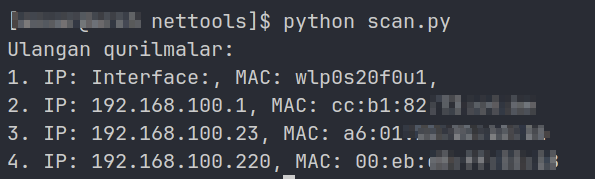

# Ping va Download Tezligi Aniqlash Python Skripti

Bu Python skripti sizga hostning ping va download tezligini o'lchashda yordam beradi.




## Qo'llanish

1. Repozitoriyani klone qilib oling:

```bash
git clone https://github.com/ozbekdev/nettols.git
```

2. Klonlangan repozitorini ichiga kiring va uni ishga tushuring (venv)

```
cd nettols
python filename.py
```

Talablar

<ul>
    <li>Python 3.x</li>
    <li>time, requests, socket kutubxonasi - speed.py</li>
    <li>subprocess, arp-scan (system tool) - scan.py</li>
</ul>


@ozbekdev tomonidan yaratilgan.
