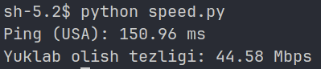

# Ping va Download Tezligi Aniqlash Python Skripti

Bu Python skripti sizga hostning ping va download tezligini o'lchashda yordam beradi.



## Qo'llanish

1. Repozitoriyani klone qilib oling:

```bash
git clone https://github.com/ozbekdev/nettols.git
```

2. Klonlangan repozitorini ichiga kiring va uni ishga tushuring

```
cd nettols
python speed.py
```

Talablar

<ul>
    <li>Python 3.x</li>
    <li>time, requests, socket kutubxonasi</li>
</ul>

Muallif
Skript @ozbekdev tomonidan yaratilgan.
